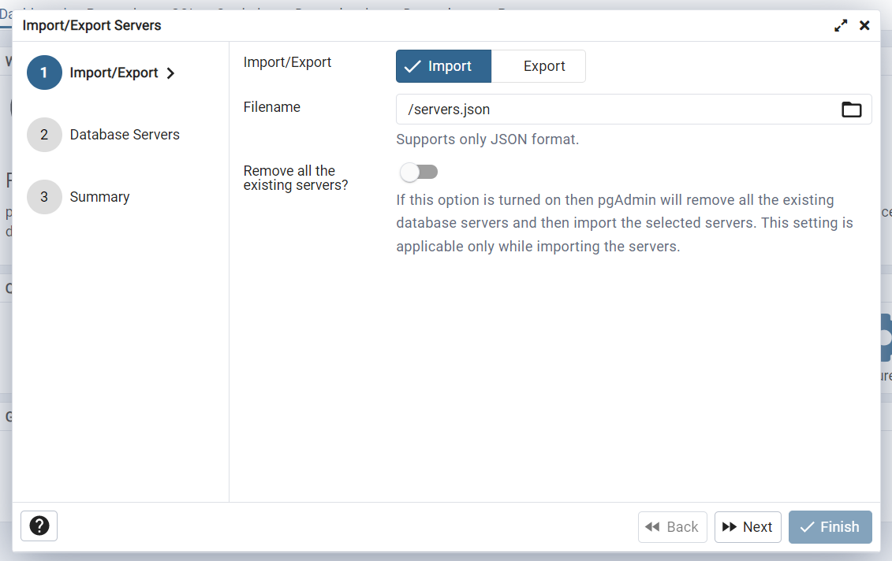

# Flask Blog

Blog build with Python using Flask. Complete with authentication, password hashing, database, forms, comments, admin privileges for the first user and error-handling. Docker-compose will bring up three containers: application, PostgreSQL database, and pgadmin4, the management tool for PostgreSQL.

## Demo


## Prerequisites
* Docker
* Docker Compose

Export database password as an environmental variable:

```shell
export DB_PASSWORD={your_password}
```

Export pgadmin4 password as an environmental variable:

```shell
export PG4_PASSWORD={your_password}
```

Export forms secret key as an environmental variable:
```shell
export FORMS_KEY={random_string}
```

## Usage

Build docker image of the application:

```shell
docker build -t flask-blog:latest .
```

Then use the docker-compose file to bring up
three containers:
```shell
docker-compose -f docker-compose.yaml up
```

The application will be available at `127.0.0.1:5000`. 
The first user to register is granted admin privileges to
do create, edit and delete posts from the blog. Other users
can only read and comment on posts. 

You can access the pgadmin4 at `127.0.0.1:8080`. The standard
email for admin user is `admin@admin.com`. The password 
is the env variable `PG4_PASSWORD` exported at the start.
The first time you log in to the pgadmin4 you will not see
the database just yet. Add it by clicking `Add New Server`.
Fill in the information as seen below in the `Connection` tab
(password is `DB_PASSWORD` env) and
name it anything you like in the `General` tab, then click save.

<div style="text-align: center">

</div>

To see the data go to `Servers-->{your_db_name}-->posts-->
Schemas-->public-->Tables`. Then right click on any table and
select `View/Edit Data-->All Rows`.

## Reference

CSS and the idea for this application came from [Angela Yu](https://github.com/angelabauer)


